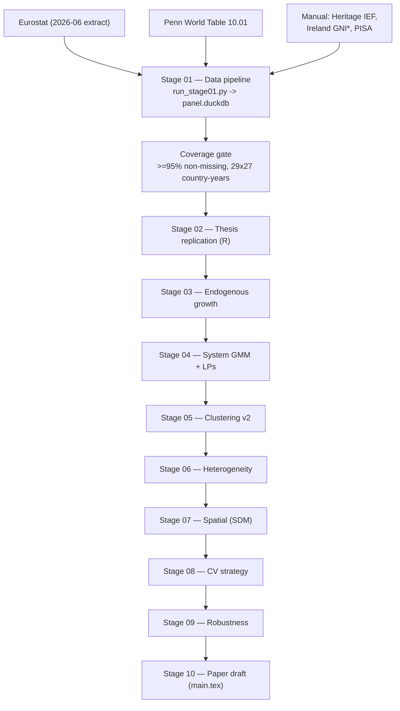

# rd-productivity-eu

**R&D → Productivity, EU Panel — Capstone Extension of 2025 Bachelor's Thesis**

Andrei Manoloiu · MSc Data Science, SDU Kolding

---

## Project summary

Extends the 2025 bachelor's thesis (augmented Solow, N=25 EU, 1998–2023, FE/RE Hausman)
into a publication-grade panel econometrics project addressing the thesis's own flagged
limitations: GMM/IV, spatial spillovers, endogenous-growth specifications, institutional
moderation, and cluster stability.

**Panel:** N=29 (EU-25 + Ireland + Norway + Iceland + Switzerland), 1998–2024  
**Stack:** Python (ingest, ML, visualisation) + R (econometrics) + DuckDB (bridge)

---

## Architecture



## Execution order

```
Week 1  Stage 01 — Data pipeline      python src/python/run_stage01.py
Week 2  Stage 02 — Replication        Rscript src/R/02_replicate_thesis.R
Week 2  Stage 03 — Endogenous growth  notebooks/03_endogenous_growth.qmd
Week 3  Stage 04 — GMM + LPs          notebooks/04_sysgmm.qmd
Week 4  Stage 05 — Clustering v2      notebooks/05_clustering_v2.ipynb
Week 4  Stage 06 — Heterogeneity      notebooks/06_heterogeneity.qmd
Week 5  Stage 07 — Spatial            notebooks/07_spatial.qmd
Week 6  Stage 08 — CV                 reports/08_cv_strategy.md
Week 6  Stage 09 — Robustness         notebooks/09_robustness.qmd
Week 7  Stage 10 — Paper draft
```

---

## Quick start

```bash
# 1. Create conda environment
conda env create -f environment.yml
conda activate rd-productivity-eu

# 2. Run Stage 01 (downloads all data, builds panel.duckdb)
python src/python/run_stage01.py

# 3. Check coverage gate
cat reports/01_audit_log.md

# 4. Run Stage 02 replication
Rscript src/R/02_replicate_thesis.R
```

---

## Manual data required

The following sources cannot be fetched programmatically and must be placed manually:

| File | Source | Path |
|---|---|---|
| Heritage IEF | heritage.org/index/explore → Export CSV | `data/raw/heritage/heritage_ief.csv` |
| Ireland GNI\* | cso.ie → National Accounts → Modified GNI | `data/raw/eurostat/ireland_gni_star.csv` |
| PISA scores | oecd.org/pisa/data/ → PISA 2022 database | `data/raw/oecd/pisa_scores.csv` |

Expected columns for `heritage_ief.csv`:
```
country_iso2, year, ief_overall, ief_rl, ief_gs, ief_re, ief_om
```

---

## Data vintage

All Eurostat series pinned to **2026-06 extract**. PWT version **10.01** (Feenstra et al.
2015). Heritage IEF: document year on ingestion. Manifest files written to each
`data/raw/<source>/manifest.jsonl`.

---

## Key hypotheses (pre-registered)

| H | Statement |
|---|---|
| H1 | γ_GOVERD > γ_BERD (public R&D effect > private), p < 0.05 |
| H2 | LP impulse response of GERD on TFP peaks at 5–7 years |
| H3 | GERD × distance-to-frontier interaction is negative |
| H4 | Indirect / direct SDM effect ratio > 1 (research-collaboration weights) |
| H5 | Catch-up cluster absorbs more spillovers than innovator cluster |
| H6 | Bootstrap-ARI ≥ 0.75 for k=2 clusters |
| H7 | GERD coefficient smaller in 2011–2024 than 1998–2010 (Bloom et al.) |

---

## Stage 01 gate

Before Stage 02: ≥ 95% non-missing for `ln_y_pc, gerd_pct, savings_pct, n_g_d,
tertiary_25_64` over 29 × 27 = 783 country-years. Check `reports/01_audit_log.md`.
